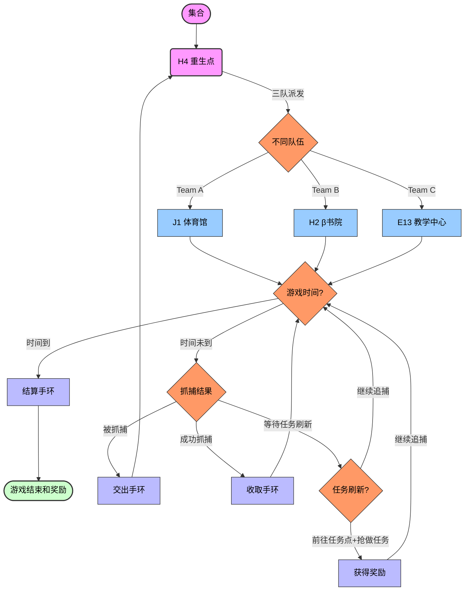

# 玩家须知

## 基本须知

* 安全第一！
* 请在游戏前确认手机电量充足。
* A队抓B队，B队抓C队，C队抓A队。
* 被抓之后需交出手环立即返回重生点并第一时间向场控报告。返回重生点的路程中无法抓人也无法被抓。
* 场地内随机出现“轰炸区”（提前3min告知；持续5min），停留在轰炸区记为死亡，扣除10分积分，场控通知其回到重生点。
* 随机分布奖励盒，贴有beta书院logo，玩家拾取获得奖励
* 高德地图定位功能现场培训使用（加入群聊）
* 建议全场使用流量以保持联络流畅

## 判断胜负：积分制

* 每个人把积分（筹码）带在身上。积分只能保留在玩家身上，无法流动。
* 完成任务：获得积分或者技能。
* 抓人：占据对方携带的所有手环。
* 被抓方返回重生点（H4）领取一个新手环。
* 设置商人staff：可以用积分兑换技能。
* 设置手环-积分兑换处（E9-C18拱桥），抓人得到的手环可以换成积分。（1手环=10积分）
* 游戏时间到，所有人在积分兑换处集合，将所有手环兑换成积分。各队伍统计总积分，最高者获胜。

## 场地限制

* 禁止长时间停留在建筑内部，仅能快速穿过。建筑内部禁止抓人。
* 避免吵闹，尤其在图书馆/学术环/寝室/...附近。
* 安全区禁止抓人。安全区范围：重生点、积分兑换处、操场草坪、随机刷新的部分任务点（staff说明）

## 技能说明

* 载具：在技能期间可以骑“滴滴青桔”；注意不得在骑车的同时抓人。持续时间由staff告知。
* 隐身：在技能发动期间可以关闭高德定位，时间结束后重新打开。持续时间由staff告知。
* 不死图腾：被抓之后可以选择发动技能（不交出手环也不返回重生点，而将“不死图腾”移交给抓捕者）；若发动技能在2min内无法被同一个人再次抓捕。
* 场控帮助：可以与场控私下联系，获得额外信息。
* 锤子：可以反杀一个来抓捕的人。

部分技能在被兑换前不公开

## 流程说明

